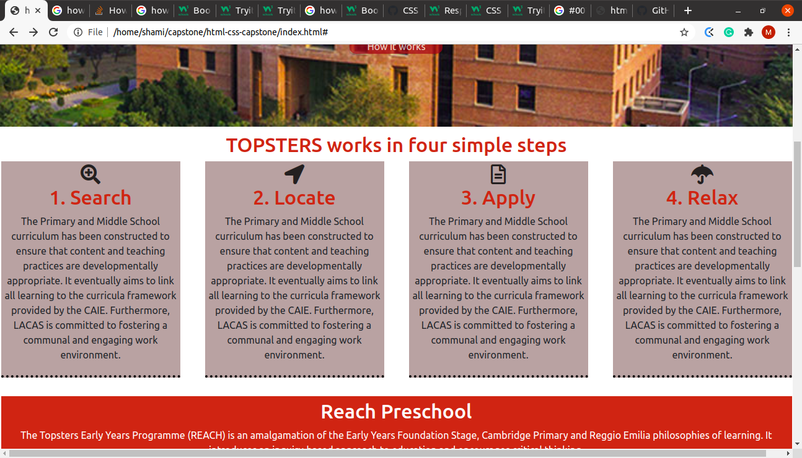
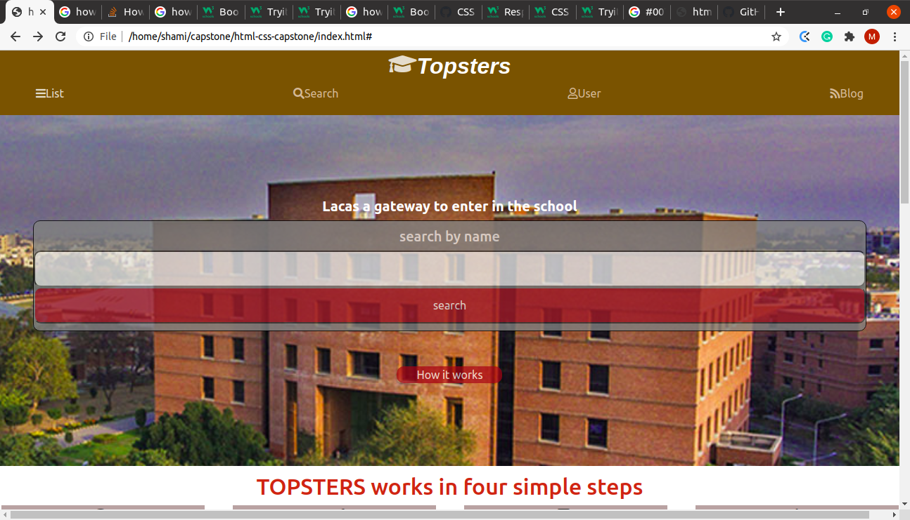

# html-css-capstone

# Newsweek Website Clone

> This is the readMe for the NewsWeek Project. It is a replica/clone of the Newsweek website.

Good day world

Lets welcome one more code in the line of many more to come during our time here at Microverse.
-Matija Maksimovic

Our website was created with bootstrap fluidity and user interaction in mind.

please enjoy!

## Built With

- CSS3
- HTML5
- Bootstrap
- Flex 

## Live Demo

[Live Demo Link](https://rawcdn.githack.com/mahtsham/html-css-capstone/544d2da4a9c24ab0ea7edd8786ecca6d778da9d3/index.html)

## Getting Started

**First ensure the assets folder is set in a location which is in the same folder as the other files. The Index and CSS should also be easily accessible. All the content in this project was linked to offline files in the assets folder.**

To get a local copy up and running follow these simple example steps.

### Prerequisites
Online website hoster ie. GoDaddy or similar

### Setup

Upload all files to the hosting service

### Install

Make sure each file is named correctly and accessible

### Usage

This website can be ran multiple times

### Run tests

Use a code editor to make any changes or use your browser to access the website offline

### Deployment

## Authors

👤 **Author1**

- GitHub: [@mahtsham](https://github.com/mahtsham)
- Twitter: [@mahtsham](https://twitter.com/mahtsham)
- LinkedIn: [mahtsham](https://linkedin.com/mahtsham)

## 🤝 Contributing

Contributions, issues, and feature requests are welcome!

Feel free to check the [issues](https://github.com/mahtsham/html-css-capstone/issues).

## Show your support

Give a ⭐️ if you like this project!

## Acknowledgments

- StackOverflow

## 📝 License

This project is [MIT](https://opensource.org/licenses/MIT) licensed.
